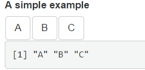
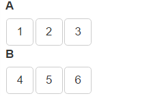
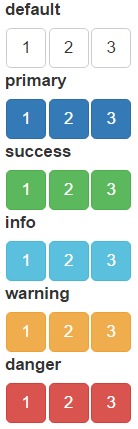

```{r, include=FALSE}
library(shiny)
library(shinyjqui)
```

The `orderInput` display a list of strings and return their order as a vector in shiny input value. Users can drag and drop the strings to change their display order, and the binding shiny input value will update accordingly. Here is a simple example:

```{r, eval=FALSE}
server <- function(input, output) {
  output$order <- renderPrint({input$foo_order})
}

ui <- fluidPage(
  orderInput(inputId = 'foo', label = 'A simple example', items = c('A', 'B', 'C')),
  verbatimTextOutput('order')
)

shinyApp(ui, server)
```



As showed in the above example, use `input$inputId_order` to get current order, where the "inputId" is the `inputId` parameter passed to the `orderInput` function.

The `items` parameter can either accept a list, an atomic vector or a factor. Based on the type of data provided, the displayed strings and their corresponding order (returned in the shiny input value) may not always the same. 

* For fully named list and vector (e.g. `c(A = "a", B = "b")`), orderInput display names (`A` and `B`) but return values (`a` and `b`) as order.
* For unnamed or partial named list and vector (e.g. `c("a", B = "b")`), values (`a` and `b`) are used both for display and order.
* For factor (e.g. `factor("a", "b")`), values (`a` and `b`) are displayed while it's levels (`1` and `2`) are used for order.

Multiple `orderInput`s can be connected to each other by passing their `inputId`s to the `connect` parameter. When connected, items from one `orderInput` can be dragged to another. See the following example:

```{r, eval=FALSE}
# items in A can be dragged to B
orderInput('A', 'A', items = 1:3, connect = 'B')
# items in B can be dragged to A
orderInput('B', 'B', items = 4:6, connect = 'A')
```



A connected `orderInput` can run in source mode by setting `as_source = TRUE`. If an item is dragged from a source-mode-`orderInput` to other `orderInput`s, the item will not be removed from the original `orderInput`, that is, drag become copy instead of cut. See the following demonstration:

```{r, eval=FALSE}
# In source mode, items dragged to B are copied
orderInput('A', 'A', items = 1:3, connect = 'B', as_source = TRUE)
orderInput('B', 'B', items = 4:6)
```


If `placeholder` is set, `orderInput` shows it when there is no item in it:

```{r, eval=FALSE}
orderInput('A', 'A', items = 1:3, connect = 'B')
orderInput('B', 'B', items = NULL, placeholder = 'Drag item here...')
```


`orderInput` uses the six predefined Bootstrap button classes to style the displayed items. Choose one of them and set in the `item_class` parameter:

```{r, eval=FALSE}
orderInput('default', 'default', items = 1:3, item_class = 'default')
orderInput('primary', 'primary', items = 1:3, item_class = 'primary')
orderInput('success', 'success', items = 1:3, item_class = 'success')
orderInput('info', 'info', items = 1:3, item_class = 'info')
orderInput('warning', 'warning', items = 1:3, item_class = 'warning')
orderInput('danger', 'danger', items = 1:3, item_class = 'danger')
```


